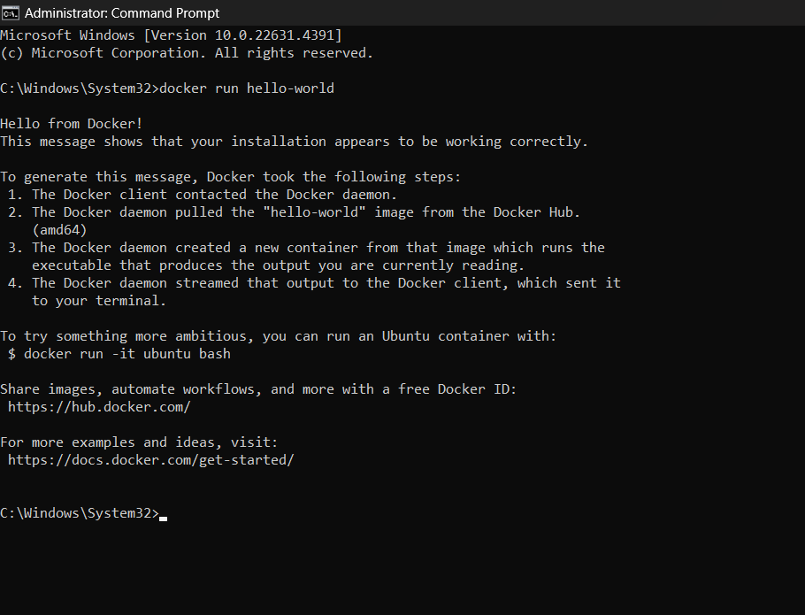

# Docker CLI Command:Docker run `hello-world`

This guide will show you how to use Docker CLI to build and run the `hello-world` image.

## Prerequisites

Ensure Docker is installed and running on your machine. You can verify this by running:

**Open the Command Prompt**

```bash
        docker --version
```


## 1. Pull the hello-world Image
Download the hello-world image by running this bellow command

```bash
        docker pull hello-world
```
## 2. Now check how is there any Container is running 

```bash 
        docker ps -a
```


## 3. Now Run the hello-world Image 

```bash
        docker run hello-world
```

