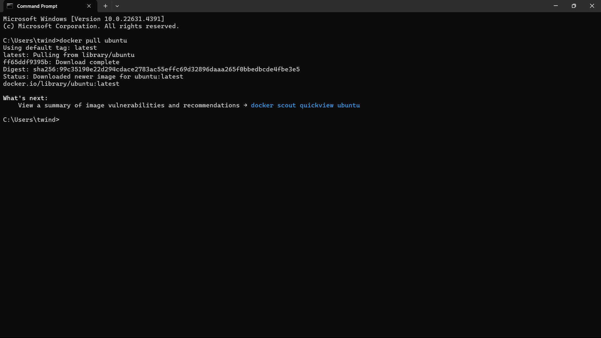
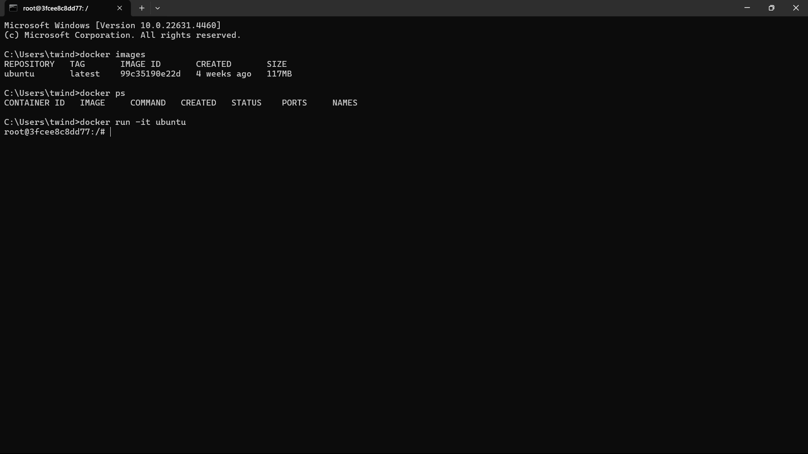

# Docker CLI Command: docker `run -it` 

The -it option in Docker CLI is often used when you want to interact with a container in a terminal session. Here’s what the options mean:

   -i (interactive): Keeps STDIN open so you can input commands.
   -t (tty): Allocates a pseudo-TTY, which gives you a terminal interface.
Together, -it allows you to open an interactive terminal session within the container.

**For example let's pull the ubuntu image and run it with the  `-it`**
## 1. Pull the ubuntu Image
Download the hello-world image by running this bellow command

```bash
        docker pull ubuntu
```

## 2. Now check is there any Container is running 

```bash 
        docker ps -a
```


The `docker run -it` command is commonly used to create and run a container interactively. Here’s a breakdown of the command options and usage.


## Basic Syntax

```bash
docker run -it [OPTIONS] IMAGE [COMMAND]
```
### Now run the ubuntu 

```bash
docker run -it ubuntu
```

