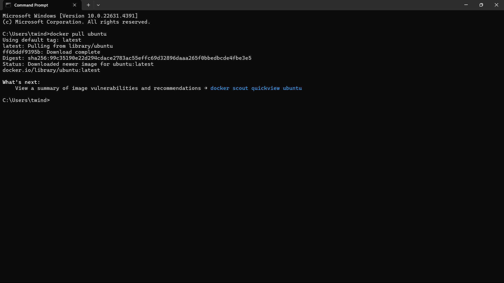
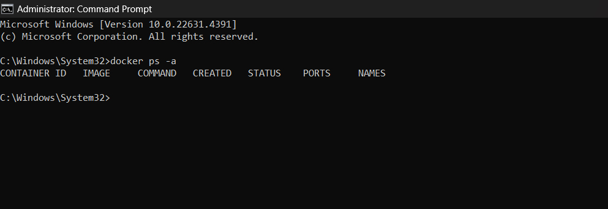
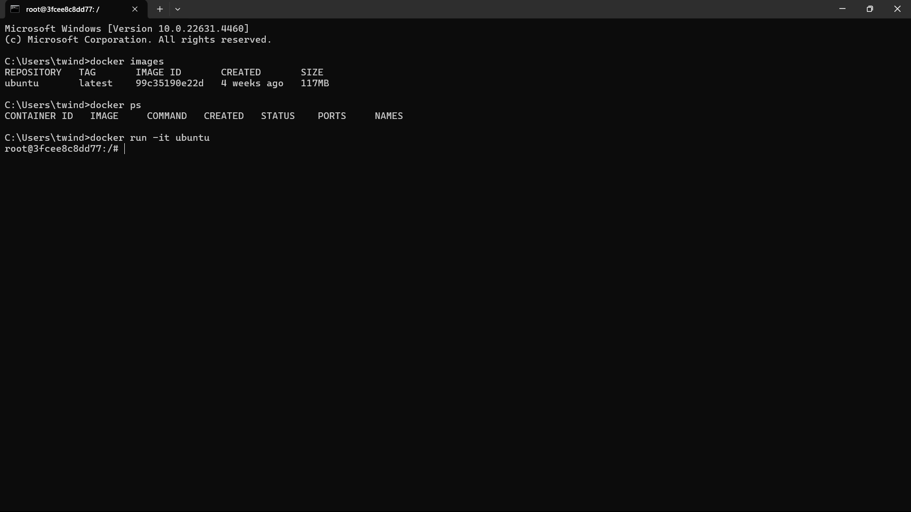
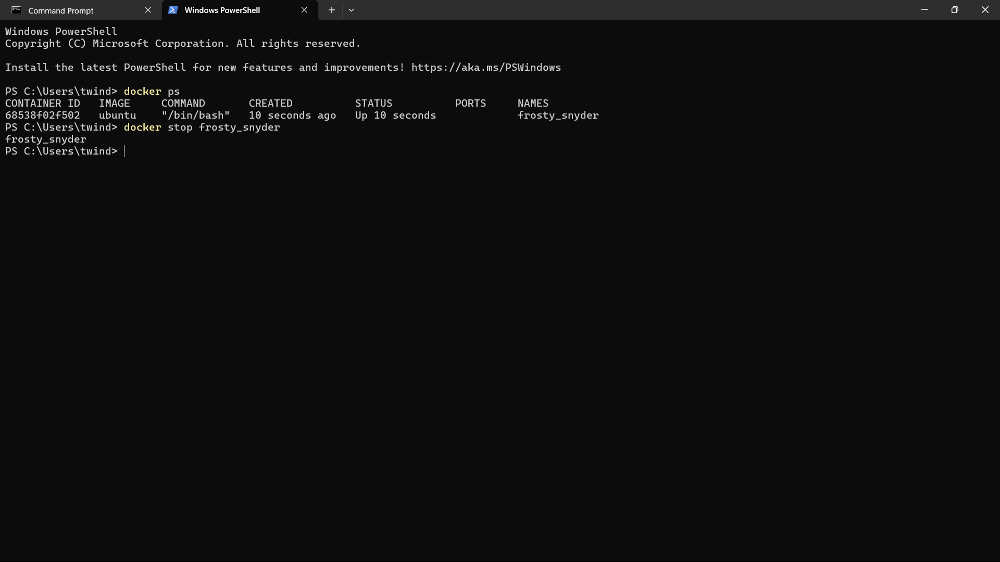

# Docker CLI Command : docker `stop` 

The docker stop command is used to stop one or more running Docker containers. This command allows Docker to terminate the container(s) gracefully, giving them a chance to complete any ongoing processes before stopping completely.

### Syntax

```bash
docker stop [OPTIONS] CONTAINER [CONTAINER...]   
```

*   **CONTAINER**: The name or ID of the container you want to stop. You can specify multiple containers at once by separating their names or IDs with a space.
    

### Example

## 1. Pull the ubuntu Image
Download the hello-world image by running this bellow command

```bash
        docker pull ubuntu
```

## 2. Now check is there any Container is running 

```bash 
        docker ps -a
```


The `docker run -it` command is commonly used to create and run a container interactively. Here’s a breakdown of the command options and usage.


## Basic Syntax

```bash
docker run -it [OPTIONS] IMAGE [COMMAND]
```
### Now run the ubuntu 

```bash
docker run -it ubuntu
```


## Now to stop the container let's get in to another command prompt terminal 

And use the bellow command 

```bash
docker ps 
```
And check the container name and stop the container

```bash 
    docker stop frosty_snyder
```
